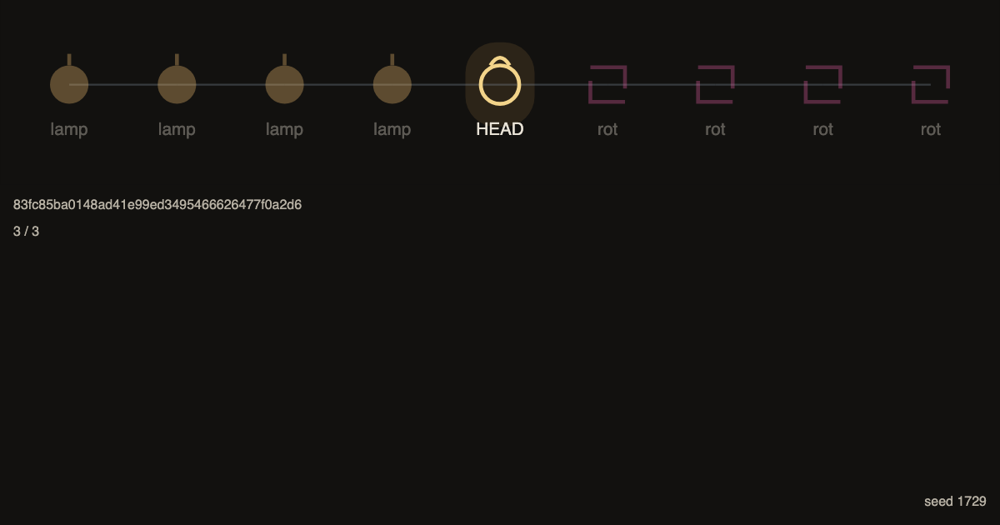

# it-worked-yesterday

**It worked yesterday. Then someone committed.**

A zero-backend browser game. The dungeon is a commit graph. The boss is the first bad commit.

You wake at a broken HEAD. A known-good ancestor is already marked. That range is the dungeon.

Each room is a commit. The suite runs. You mark it good or bad. The engine checks out the midpoint.

You accuse one SHA. If it is the first bad, you were right. Share the seed.



## Play live

_GitHub Pages URL goes here._

## Run locally

```
npm install
npm run dev
```

Quality gates:

```
npm test
npm run typecheck
npm run lint
npm run e2e
```

## Design

[docs/design.md](docs/design.md) is the source of truth.
